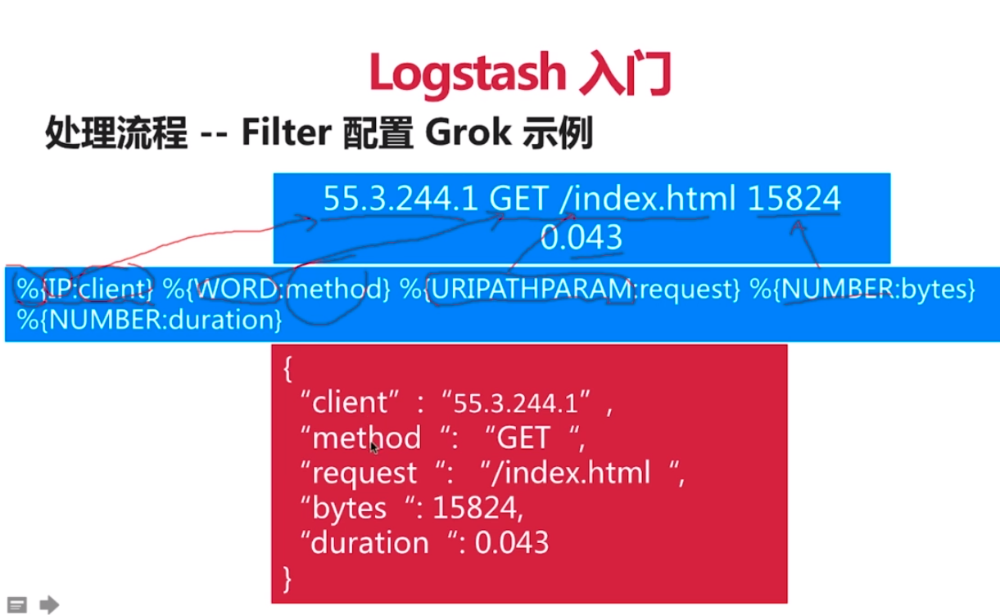
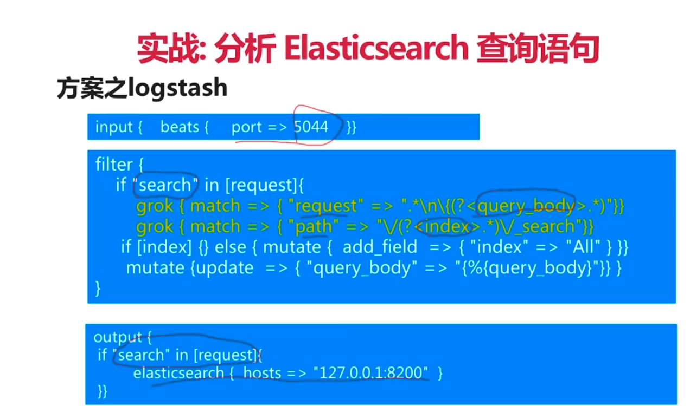
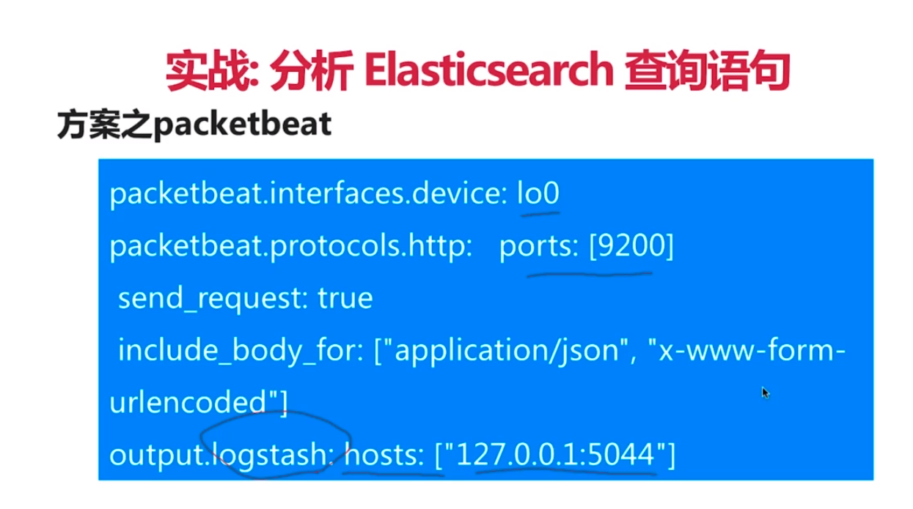

#### Elasticsearch 入门
1. 依赖
>
    		<dependency>
    			<groupId>org.elasticsearch.client</groupId>
    			<artifactId>transport</artifactId>
    			<version>${elasticsearch.version}</version>
    		</dependency>
>

2. 配置client bean
>
    @Configuration
    public class Config {
    
        /**
         * 构造es连接的客户端
         */
        @Bean
        public TransportClient transportClient() throws UnknownHostException {
            //此处可构造并传入多个es地址,也就是一整个集群的所有节点
            //构造一个地址对象,查看源码得知,ip使用4个字节的字节数组传入
            //此处的端口号是es的TCP端口号,默认为9300
            TransportAddress node = new TransportAddress(
                    InetAddress.getByAddress(new byte[]{106,14,7,29}),9300
            );
    
            Settings settings = Settings.builder()
                    .put("cluster.name", "zx")
                    .build();
            //如果settings为空,可以使用Settings.EMPTY
            //但是不传入settings,会无法访问
            TransportClient client = new PreBuiltTransportClient(settings);
            client.addTransportAddress(node);
            return client;
        }
    }
>

3. 增删改查
>
    //es连接
        @Autowired
        private TransportClient client;
    
        /**
         * 查询es
         */
        @GetMapping("/get/book/novel")
        public ResponseEntity get(String id) {
            if (StringUtils.isEmpty(id)) {
                return ResponseEntity.notFound().build();
            }
            GetResponse result = client.prepareGet("book", "man", id).get();
    
            //没找到,返回404
            if (!result.isExists()) {
                return ResponseEntity.notFound().build();
            }
    
            return ResponseEntity.ok().body(result.getSource());
        }
    
        /**
         * 新增
         */
        @PostMapping("/add/book/novel")
        public ResponseEntity add(String title, String author,
                                  Integer wordCount, @DateTimeFormat(pattern = "yyyy-MM-dd HH:mm:ss") Date publishDate) {
            try {
                //构造json
                XContentBuilder content = XContentFactory.jsonBuilder()
                        .startObject()
                        .field("title", title)
                        .field("author", author)
                        .field("word_count", wordCount)
                        .field("publish_date", publishDate.getTime())
                        .endObject();
                //增加并接收返回结果
                IndexResponse result = client.prepareIndex("book", "man")
                        .setSource(content)
                        .get();
                return ResponseEntity.ok().body(result.getId());
            } catch (IOException e) {
                e.printStackTrace();
                return ResponseEntity.status(HttpStatus.INTERNAL_SERVER_ERROR).build();
            }
        }
    
        /**
         * 删除
         */
        @DeleteMapping("/delete/book/novel")
        public String delete(String id) {
            DeleteResponse result = client.prepareDelete("book", "man", id).get();
            return result.getResult().toString();
        }
    
        /**
         * 更新
         */
        @PutMapping("/update/book/novel")
        public String update(
                String id,
                @RequestParam(required = false) String title
        ) throws IOException, ExecutionException, InterruptedException {
    
    
            //构造json
            XContentBuilder content = XContentFactory.jsonBuilder()
                    .startObject()
                    .field("title", title)
                    .endObject();
            //更新请求
            UpdateRequest updateRequest = new UpdateRequest("book", "man", id);
            updateRequest.doc(content);
    
    
            UpdateResponse result = client.update(updateRequest).get();
            return result.getResult().toString();
        }
    
        /**
         * 复合查询
         */
        @PostMapping("/query/book/novel")
        public List<Map<String, Object>> query(String title,String author,Integer gtWordCount,Integer ltWordCount) {
            //构造布尔查询
            BoolQueryBuilder boolQuery = QueryBuilders.boolQuery();
            boolQuery.must(QueryBuilders.matchQuery("author", author));
            boolQuery.must(QueryBuilders.matchQuery("title", title));
    
            //构造范围查询
            RangeQueryBuilder rangeQuery = QueryBuilders.rangeQuery("word_count")
                    .from(gtWordCount).to(ltWordCount);
            //将两个查询用filter结合
            boolQuery.filter(rangeQuery);
    
            //请求体
            SearchRequestBuilder builder = client.prepareSearch("book")
                    .setTypes("man")
                    .setSearchType(SearchType.DFS_QUERY_THEN_FETCH)
                    .setQuery(boolQuery)
                    .setFrom(0)
                    .setSize(10);
            //输出请求体
            System.out.println(builder);
    
            //请求并获取响应
            SearchResponse response = builder.get();
    
            List<Map<String, Object>> result = new ArrayList<>();
            for (SearchHit item : response.getHits()) {
                result.add(item.getSourceAsMap());
            }
    
            return result;
        }
>

#### Elasticsearch 安装
1. 解压
2. 创建用户
>
    useradd zx  创建名为zx的用户
    passwd zx 给zx设置密码
    su zx 切换到zx用户
    
    切换到root
    chown zx /zx/elasticsearch-6.0.0 -R 给zx权限
>

3. elasticsearch.yml 增加 network.host: 0.0.0.0

4.  max file descriptors [65535] for elasticsearch process is too low, increase to at least [65536]
root用户下 
vim /etc/security/limits.conf 
在末尾增加
>
    * soft nofile 65536
    * hard nofile 65536
    * soft nproc 2048
    * hard nproc 4096
>

5. max virtual memory areas vm.max_map_count [65530] is too low, increase to at least [262144]
vim /etc/sysctl.conf 
sysctl -p

5.启动 ./bin/elasticsearch
后台启动 加上 -d 或 &
带参数启动
./bin/elasticsearch -Ecluster.name=xx -Ehttp.port=8200 -Epath.date=/xxx/xx

6. 访问http://106.14.7.29:9200 即可看到信息

7. 停止   
JPS 看进程号  
kill  -9  进程号  或 kill -SIGTERM 进程号

#### Elasticsearch分布式配置
* vim config/elasticsearch.yml 追加
>
    cluster.name: zx
    node.name: master 
    node.master: true
    network.host: 0.0.0.0 这句上面为了外网访问已经加了,就别加了
>

* 将其复制出一份
>
    创建新的目录
    mkdir ./es_slave 
    拷贝过去
    cp ./elasticsearch-6.0.0.tar.gz ./es_slave/
    解压
    tar -zxvf ./elasticsearch-6.0.0.tar.gz 
    修改文件
    vim ./config/elasticsearch.yml
    追加
    cluster.name: zx
    node.name: slave1 
    network.host: 0.0.0.0
    discovery.zen.ping.unicast.hosts: [127.0.0.1] # 该ip就是主节点的ip
    http.port: 9201       # 因为是在一台机器上配置,所以需要修改端口
    
    注意此处需要给新的用户权限,启动该节点
>

* 这样应该就可以了.但是我未验证,因为...服务器内存不足了
* 已经成功,内存不足,就将config/jvm.options中的jvm内存改小即可

#### 配置说明
* 配置文件位于config目录中
    * elasticsearch.yml es相关配置
    >
        cluster.name 集群名字
        node.name 节点名
        networ.host/http.port 网络地址和端口,用于http和transport服务使用
        path.data 数据存储地址
        path.log 日志存储地址
    >
    * jvm.options jvm相关配置
    >
        基本只需要修改其最大内存和最小内存即可
    >
    * log4j2.properties 日志相关配置
* Development和Production模式说明
    * 以transport的地址是否会绑定在localhost为判断标准network.host
    * Development模式会在启动时以warring方式提示配置检查异常
    * Production模式会以error方式提示,并退出

* 在启动时可以使用./bin/elasticsearch -Ehttp.port=8200 -Epath.data=node2  这样的方式修改配置

#### HEAD插件安装-提供了一个elasticsearch的管理界面
* url: https://github.com/mobz/elasticsearch-head
* 下载该项目到服务器,可以直接拷贝download 的链接.然后在服务器输入
>
     wget xxxxxxx
     解压 unzip master.zip
     解压后得到 elasticsearch-head-master
>

* 此处需要安装node
>
    下载 注意,该tar.xz是编译好的文件
    wget https://nodejs.org/dist/v8.9.3/node-v8.9.3-linux-x64.tar.xz
    解压
    tar xvJf ./node-v8.9.3-linux-x64.tar.xz
    配置环境变量
    vim /etc/profile
        export NODE_HOME=xxxx
        export PATH=${NODE_HOME}/bin:$PATH
    source /etc/profile
    运行node -v 即可看到版本号
    运行npm -v 也已经OK
>

* 进入根目录 npm install 开始安装
    如有意外,可尝试使用淘宝npm镜像
>
    npm install -g cnpm --registry=https://registry.npm.taobao.org
    使用 
    cnpm install
    如果第一次失败,再试一次即可
>
* 然后 npm run start 
* 输入 http://106.14.7.29:9100/ 即可访问(如果不是中文,可以在url后面加 ?lang=zh)

* 修改elasticsearch,让插件和elasticsearch可以交互
>
    在elasticsearch根目录
    vim config/elasticsearch.yml 
    在末尾增加如下:
    http.cors.enabled: true
    http.cors.allow-origin: "*"
    其他可查看该插件的github文档
>

* 启动elasticsearch后,再启动插件
* 然后在顶部的输入框中输入 http://106.14.7.29:9200/ 点击连接即可(因为我是在其他机器访问云服务器的,它默认连接本地的9200端口)
* npm run start & 后台运行
* 关闭
>
    jobs 显示所有任务
    找到该插件的任务,前面有一个序号
    fg 序号   将该任务弄到前台
    ctrl + c 杀死即可
>

#### 基础概念
* 集群主从.  
一个Master多个Slave.  
每个集群有一个唯一的名字  cluster.name
每个节点有唯一的名字  node.name

* 索引  含有相同属性的文档集合  
类似一个数据库,例如可以存储图书索引,家具索引等
* 类型 一个索引可以定义一个或多个类型,文档必须属于一个类型 
类似一个表,例如图书索引细分为科普类/小说类等
* 文档 可以被索引的基本数据单位 
类似一行记录,例如小说类中的每本小说都是一个文档

* 分片 每个索引有多个分片,每个分片是一个Lucene索引 默认5个分片,只能在创建索引的时候指定,无法后期修改
如果只有一个索引,容易有并发压力;
分成多个,每个分片可以分摊并发.
* 备份 拷贝一份分片就完成了分片的备份 默认一个备份

#### 基本用法
* API基本格式
http://<ip>:<port>/<索引>/<类型>/<文档id>
* 常用http方法
GET/POST/POST/DELETE

* 创建索引
* 非结构化创建 索引的mappings属性为空,表示是非结构化索引
> 直接在head的控制台点击索引,然后创建  

* 结构化创建
>
    点击复合查询,输入
    {
      "novel": {
        "properties": {
          "title": {
            "type": "text"
          }
        }
      }
    }
    然后点击易读,点击验证JSON,点击提交请求
    此时,索引的mappings就会增加上如上json
    (上面其实就是发送了一个http请求,可以使用postman来进行)
>

使用postman创建.
>
    restful新增请求
    PUT请求
    指定ip,端口号,索引名
    url: 106.14.7.29:9200/people 
    选择body-raw-json格式
    输入
    {
    	"settings":{
    		"number_of_shards": 3,
    		"number_of_replicas":1
    	},
    	"mappings":{
    		"man":{
    			"properties":{
    				"name":{
    					"type":"text"
    				},
    				"country":{
    					"type":"keyword"
    				},
    				"age":{
    					"type":"integer"
    				},
    				"date":{
    					"type":"date",
    					"format":"yyyy-MM-dd HH:mm:ss||yyyy-MM-dd||epoch_millis"
    				}
    			}
    		},
    	}
    }
    settings表示设置分片数为3,备份数为1
    mappings也就是结构话索引的属性
    有一个man(索引的类型)有名字(text类型)/国家(关键词类型)/年龄(整型)/出生日期(日期型以及格式)等属性,;
    (本来还可以增加其他和man同级的属性,但6.X后,只支持1个类型)
>

* 插入    
指定文档id插入
>   
    PUT请求-新增
    people:索引; man:索引类型; 1:指定文档id;
    url:106.14.7.29:9200/people/man/1
    
    内容,根据之前定义的索引的man类型的属性:
    {
    	"name":"郑星",
    	"country":"China",
    	"age":30,
    	"date":"1996-04-16"
    }
    可以在head的控制台-数据浏览中看到
>

自动产生文档id插入
将上面的指定id的url改为:
106.14.7.29:9200/people/man/
请求方法改为POST即可

* 修改
>
    POST方法
    url:106.14.7.29:9200/people/man/1/_update
    内容,doc表示修改的是文档
    {
    	"doc":{
    		"name":"修改后的郑星"
    	}
    }
    或者换成如下内容,表示用脚本的方式修改,lang表示可用的脚本语言
    {
    	"script":{
    		"lang":"painless",
    		"inline":"ctx._source.age += 20"
    	}
    }
    或如下脚本
        {
        	"script":{
        		"lang":"painless",
        		"inline":"ctx._source.age = params.age",
        		"params":{
        			"age":100
        		}
        	}
        }
>

* 删除
>   
    删除people索引中man类型的文档id为1的文档
    DELETE请求
    url: 106.14.7.29:9200/people/man/1
    
    删除整个book索引,此时该索引下的所有文档都会被删除
    DELETE请求 
    url: 106.14.7.29:9200/people
>

* 查询
简单查询
>
    查询book索引,novel类型,id为1的文档
    GET
    URL:106.14.7.29:9200/book/book/1
>
条件查询
>
    查询所有文档
    POST
    URL:106.14.7.29:9200/book/_search
    {
    	"query":{
    		"match_all":{}
    	}
    }
    
    查询一条数据,from表示从哪里返回  
    {
    	"query":{
    		"match_all":{}
    	},
    	"from": 1,
    	"size": 1
    }
    
    根据作者名查询
    {
    	"query":{
    		"match":{
    			"author":"笛安"
    		}
    	}
    }
    
    根据作者名查询,并根据日期倒序排序
    {
    	"query":{
    		"match":{
    			"author":"笛安"
    		}
    	},
    	"sort":[
    		{"publish_date":{"order":"desc"}}
    	]
    }
>

聚合查询
>
    第一种
    也就是数据库中的group by.
    将所有文档根据作者分组查询. 
    group_by_word_count:可任意起名
    terms:条款,是固定的格式
    POST
    URL:106.14.7.29:9200/book/_search
    {
    	"aggs":{
    		"group_by_word_count":{
    			"terms":{
    				"field":"author"
    			}
    		}
    	}
    }
    
    返回两组聚合信息,分别根据作者和日期聚合,
    所谓的聚合就是,把相同值的属性进行统计.
    例如鲁迅有5本书.那么根据作者聚合的结果就是
    key:鲁迅, doc_count:5
    {
    	"aggs":{
    		"group_by_word_count":{
    			"terms":{
    				"field":"author"
    			}
    		},
    		"group_by_publish_date":{
    			"terms":{
    				"field":"publish_date"
    			}
    		}
    	}
    }
    
    第二种,统计计算
    统计word_count属性的相关信息
    总数/最大值/最小值/平均值/求和等
    {
    	"aggs":{
    		"grades_word_count":{
    			"stats":{
    				"field":"word_count"
    			}
    		}
    	}
    }
    
    直接获取它的最小值
    {
        	"aggs":{
        		"grades_word_count":{
        			"min":{
        				"field":"word_count"
        			}
        		}
        	}
        }
>

* 高级查询
子条件查询-特定字段查询所指特定值
>   
    Query Context
    查询过程中,除了判断文档是否满足查询条件外,es还会计算一个_score来标识匹配程度,用来判断匹配契合度.
        全文本查询 针对文本类型数据
        字段级别查询 针对结构化数据,如数字/日期等
        
        查询出标题和 java入门 相关的所有文档.  python入门这样的书名也会被查询出,不过_score比较低
                {
                	"query":{
                		"match":{
                			"title":"java入门"	
                		}
                	}
                }
                这样就只会查询出一条匹配度最高的,当然也可能为空
                {
                	"query":{
                		"match_phrase":{
                			"title":"java入门"	
                		}
                	}
                }
                
                多条件查询,只要其中一个字段中匹配了查询值即可
                {
                	"query":{
                		"multi_match":{
                			"query":"笛安",
                			"fields":["author","title"]
                		}
                	}
                }
    
    Query String 语法查询
    
    查询所有字段有和 东霓 相关值的文档
    {
    	"query":{
    		"query_string":{
    			"query":"东霓"
    		}
    	}
    }
    
    查询所有字段有和 东霓或李时珍 相关值的文档
    {
    	"query":{
    		"query_string":{
    			"query":"(东霓) OR 李时珍"
    		}
    	}
    }
    
    
    查询指定字段有和 东霓或李时珍 相关值的文档
    {
    	"query":{
    		"query_string":{
    			"query":"(东霓) OR java",
    			"fields":["author","title"]
    		}
    	}
    }
    
    {
    	"query":{
    		"term":{
    			"title":"java"
    		}
    	}
    }
    
    字数在大于等于1000,小于等于2000
    {
    	"query":{
    		"range":{
    			"word_count":{
    				"gte":1000,
    				"lte":2000
    			}
    		}
    	}
    }
    
    Filter Context
    只判断文档是否满足条件,只有yes或no
    会对结果缓存
    
    {
    	"query":{
    		"bool":{
    			"filter":{
    				"term":{
    					"title":1000
    				}
    			}
    		}
    	}
    }
>

复合条件查询-以一定的逻辑组合子条件查询 
固定分数查询
>
    固定分数(_score)的查询.如果不加constant_scoreconstant_score,每个文档的分数会不同,加了都会是同一个分数
    constant_score 只支持filter
    {
    	"query":{
    		"constant_score":{
    			"filter":{
    				"match":{
    					"title":"入门"
    				}
    			}
    		}
    	}
    }
    不仅固定分数,还指定了分数
    {
    	"query":{
    		"constant_score":{
    			"filter":{
    				"match":{
    					"title":"入门"
    				}
    			},
    			"boost":2
    		}
    	}
    }
>

布尔查询
>
    满足其中任意一个即可,相当于or
    如果把should改为must,则必须满足所有条件.相当于and
    还有must_not 一定不能满足条件
    {
        "query":{
            "bool":{
                "should":[
                    {
                        "match":{
                            "author":"笛安"
                        }
                    },
                    {
                        "match":{
                            "title":"东霓"
                        }
                    }
                    
                ]
            }
        }
    }
    
    返回结果后,在过滤出某个条件的文档
    {
    	"query":{
    		"bool":{
    			"should":[
    				{
    					"match":{
    						"author":"李时珍"
    					}
    				},
    				{
    					"match":{
    						"title":"东霓"
    					}
    				}
    			],
    			"filter":[
    				{
    					"term":{
    						"word_count":4000
    					}
    				}
    			]
    		}
    	}
    }
>

    

#### ElasticSearch spring boot stater data elasticsearch 框架 只支持2.X版本
1. 引入依赖
>
    	compile('org.springframework.boot:spring-boot-starter-data-elasticsearch')
>

2. 新建实体类
>
    /**
     * author:ZhengXing
     * datetime:2017-12-04 21:15
     * es文档类
     */
    @Document(indexName = "blog",type = "blog")
    @Data
    @NoArgsConstructor(access = AccessLevel.PROTECTED)//防止直接使用
    public class EsBlog implements Serializable{
        @Id
        private String id;//string的id
        private String title;
        private String summary;//摘要
        private String content;
    
        public EsBlog(String title, String summary, String content) {
            this.title = title;
            this.summary = summary;
            this.content = content;
        }
    }
>

3. 数据操作类:
和spring data jpa类似,都是被springData包装过的
>
    /**
     * author:ZhengXing
     * datetime:2017-12-04 21:22
     * es博客 文档
     */
    public interface EsBlogRepository extends ElasticsearchRepository<EsBlog,String> {
    
        /**
         * 查询不重复的,标题包含,或摘要包含,或正文包含该字符的分页的数据
         *
         * @return
         */
        Page<EsBlog> findDistinctEsBlogByTitleContainingOrSummaryContainingOrContentContaining(
                String title, String summary, String content, Pageable pageable
        );
    }
>

* 需要注意的是spring boot stater data elasticsearch 中整合的是2.4.6版本的elasticsearch.需要安装最低支持版本的才能操作.  
如果需要使用最新版,就无法使用spring data框架
 
 
#### IDEA配置文件修改
根目录的bin中的idea64.exe.vmoptions
>
    -Xms4096m
    -Xmx4096m
    -XX:ReservedCodeCacheSize=1024m
    -XX:+UseConcMarkSweepGC
    -XX:SoftRefLRUPolicyMSPerMB=50
    -XX:ParallelGCThreads=4
    -ea
    -Dsun.io.useCanonCaches=false
    -Djava.net.preferIPv4Stack=true
    -XX:+HeapDumpOnOutOfMemoryError
    -XX:-OmitStackTraceInFastThrow

>

#### Kibana入门
1. 下载 注意版本和es一致
> wget https://artifacts.elastic.co/downloads/kibana/kibana-6.0.1-linux-x86_64.tar.gz
2. 解压
> tar -zxvf kibana-6.0.1-linux-x86_64.tar.gz
3. 修改config/kibana.yml 
>
    elasticsearch.url 设置自己的es地址,默认是本机的9200端口
    server.host 地址,如果需要外网访问,需要改为 "0.0.0.0"
    server.port 端口
>
4. 启动  
./bin/kibana  
后台启动  
./bin/kibana & 
带参数启动 指定了连接的es地址 和 自身启动的端口号
./bin/kibana -e http://127.0.0.1:8200 -p 8601

5. 访问 http://106.14.7.29:5601 进入  
在该页面的dev tools 中可以对连接的es进行curd

6. 关闭
jobs  查看所有任务
fg <id> 将指定id任务移动到前台
ctrl + c 关闭它

#### Beats入门-轻量级数据传输者-该框架下不同的数据类型的框架需要单独安装
* Metricbeat 度量数据
* Winlogbeat Windows数据
* Heartbeat 健康检查
* Packetbeat 网络数据
    * 实时抓取网络包
    * 自动解析应用层协议  
        * ICMP(V6 AND V4)
        * DNS
        * HTTP
        * MySql
        * Redis
    * Wireshark
    
    * 解析elasticsearch http请求
    >
        一些配置.
        packetbeat.interfaces.device:any   #指定网卡,any指所有网卡
        packetbeat.protocols.http: 
            ports:[9200]  # 抓取http协议9200端口
            send_request: true   # 抓取时还抓取http协议的body
            include_body_for:["application/json","x-www-form-urlencoded"]  # 抓取的body类型
        output.console:   # 配置在控制台输出
            pretty: true
            
        运行,指定了上面这些配置的文件es.yml ,-strict.perms=false表示不检查权限
        ./packetbeat -e -c es.yml -strict.perms=false
        
        下载
        wget https://artifacts.elastic.co/downloads/beats/packetbeat/packetbeat-6.0.1-linux-x86_64.tar.gz
        解压
        tar -zxvf packetbeat-6.0.1-linux-x86_64.tar.gz
    >
    
* Filebeat 日志文件
    * 处理流程
    >
        输入 Input
        处理 Filter
        输出 Output
        每个prospector(观察者)对应若干日志文件,如果日志有了变化,harvestor(收集器)处理该变化,将数据发送给es等
    >
    
    * Input配置 yaml语法
    >
        filebeat.prospectors
        如下配置了两个Prospector,每个Prospector对应若干个日志文件
        日志类型有log和stdin(标准输入)
        
        -input_type:log
        paths:
            -/var/log/xx/xxx-*.log
            
        -input_type:log
        paths:
            -/var/log/xxxxx/*.log
            -/var/log/*.log
    >
    
    * Filebeat Output配置
    >
        支持输出到Console/Elasticsearch/Logstash/Kafka/Redis/File
        
        如下是输出到es
        ouput.elasticsearch:
            hosts:["http://127.0.0.1:9200"]
            username:"admin"
            password:"xxx"
        输出到console
        output.console:
            pretty.true
    >
    
    *Filebeat Filter配置
    >
        Input时处理
        Include_lines 根据条件读取这行
        exclude_lines 根据条件不读取这行
        exclude_files 根据条件是否读取该文件
        
        Output前处理-Processor
        drop_event 如果读取的数据满足条件,直接丢弃
        drop_fields 丢弃某个字段
        Decode_json_fields 对符合条件的数据进行json解析
        Inclue_fields 取某些字段
        
        丢弃符合该正则的数据
        processors:
            -drop_event:
                when:
                    regexp:
                        message:"^XXX:"
                        
        将数据的xx字段进行json解析
        processors:
            -decode_josn_fields:
                fields:["xx"]
    >
    
    * Elasticsearch Ingest Node
        * 新增的node类型
        * 在数据写入es前对数据进行处理转换
        * pipeline api 
    
    * Filebeat Module简介
        * 对社区中常见需求进行封装增加易用性
            * 例如nginx/apache/mysql日志等 
            * 封装内容
                * filebeat.yml 配置
                * ingest node pipeline 配置
                * Kinbana dashboard 配置
                
    * Filebeat收集nginx log
        * 通过stdin收集日志
        * 通过console输出结果
        * Filebeat安装
            1. 下载
            > wget https://artifacts.elastic.co/downloads/beats/filebeat/filebeat-6.0.1-linux-x86_64.tar.gz
            2. 解压
            > tar -zxvf filebeat-6.0.1-linux-x86_64.tar.gz
        * 我在其根目录新建了一个tmp文件夹,放入了nginx的日志
        * 并在根目录放了nginx.yml,配置如下
        >
            filebeat.prospectors:
                - input_type: stdin
            output.console:
                pretty: true
        >
        * 运行如下命令,将日志输入filebeat
        表示从该日志文件中取2行,(注意中间| 分隔了两个命令)然后使用filebeat命令 -e -c ,然后指定配置文件即可
        > tail -n 2 /zx/tmp/nginx_logs  |  ./filebeat -e -c nginx.yml 
        * 日志就被输出回了linux的控制台上
        
        
#### Logstash入门-数据传输者
* 处理流程
    * Input 输入
        * 支持file/redis/beats/kafka
    * Filter 过滤
        * grok 将非结构化数据转为结构化数据
        * mutate 对结构化数据进行curd
        * drop
        * date
    * Output
        * 支持stdout(标准输出)/es/redis/kafka
* 配置    
    * Input输入配置
    > 
        配置输入为文件,并指定路径
        input{file{path=> "/tmp/abc.log"}}    
    >
    * Output输出配置
    >
        配置输出为标准输出,用的编码是rubydebug
        output{stdout{codec => rubydebug}}
    >
    * Filter配置     
        * grok
            * 基于正则表达式提供了丰富可重用的pattern,基于此可将非结构化数据结构化处理
            
            * 如图所示,将该数据转为了结构化数据.IP/WORD/NUMBER等是类型.后面是字段名
        * Date
            * 将字符串类型的时间字段转为时间戳
        * Mutate
            * 进行CURD等字段相关处理
* 收集nginx log
    * 安装
    >
        下载
        wget https://artifacts.elastic.co/downloads/logstash/logstash-6.0.1.tar.gz
        解压
        tar -zxvf logstash-6.0.1.tar.gz
        准备好配置文件.conf
            input {
              stdin { }
            }
            
            filter {
              grok {
                match => {
                  "message" => '%{IPORHOST:remote_ip} - %{DATA:user_name} \[%{HTTPDATE:time}\] "%{WORD:request_action} %{DATA:request} HTTP/%{NUMBER:http_version}" %{NUMBER:response} %{NUMBER:bytes} "%{DATA:referrer}" "%{DATA:agent}"'
                }
              }
            
              date {
                match => [ "time", "dd/MMM/YYYY:HH:mm:ss Z" ]
                locale => en
              }
            
              geoip {
                source => "remote_ip"
                target => "geoip"
              }
            
              useragent {
                source => "agent"
                target => "user_agent"
              }
            }
            
            output {
                stdout {
                 codec => rubydebug 
                 }
            }
            
        运行,即可
        tail -n 2 /zx/tmp/nginx_logs | ./bin/logstash -f nginx_logstash.conf 
        
        停止
        ps -ef | gerp logstash
        kill -9 <进程号>
        
        如果提示内存不足,可修改config/jvm.option 中的-Xms 和 -Xmx参数
    >

* 微实战-分析es查询语句
    * 收集es集群的查询语句
    * 分析查询语句的常用语句/响应时长等
* 方案
    * Packetbeat + Logstash 完成数据收集工作
    * Kibana + Elasticsearch 完成数据分析工作
    
* 进程
    * Production Cluster 生产者集群
        * es 9200
        * kibana 5601
    * monitoring Cluster 监控集群
        * es 8200
        * Kibana 8601

* Logstash配置

* Packetbeat配置  
注意网卡可替换为any,表示监听所有网卡

* 运行
    * 运行监听集群的es 8200.指定一个path.data路径
    > ./bin/elasticsearch -Epath.data=/zx/tmp/data & 
    * 运行监听集群的kibana 8601,并连接8200的es
    >  ./kibana-6.0.1-linux-x86_64/bin/kibana -e http://127.0.0.1:8200 -p 8601 &
    * 运行生产集群的es 9200 .指定一个path.data
    >  elasticsearch-6.0.0/bin/elasticsearch -Epath.data=/zx/tmp/data1 &
    * 运行生产集群的kibana 5601,连接9200的es
    > kibana-6.0.1-linux-x86_64/bin/kibana -e http://127.0.0.1:9200 -p 5601 &
    
    * 准备logstash运行配置文件search.conf
    >
        input {
            beats {
                port => 5044
            }
        }
        filter {
            if "search" in [request]{
                grok {
                    match => { "request" => ".*\n\{(?<query_body>.*)"} 
                }
                grok {
                    match => { "path" => "\/(?<index>.*)\/_search"}     
                }
             if [index] {
              } else {
                    mutate {
                      add_field  => { "index" => "All" }
                }
              }
        
              mutate {
                      update  => { "query_body" => "{%{query_body}"}}
              }
        
          #    mutate {
          #        remove_field => [ "[http][response][body]" ]
          #    }
        }
        
        output {
          #stdout{codec=>rubydebug}
        
          if "search" in [request]{
                elasticsearch {
                hosts => "127.0.0.1:8200"
                }
           }
        }
    >
    * 启动,此时该进程会监听5044端口的输入
    > ./bin/logstash -f search.conf
    
    * 准备packetbeat的启动配置文件search.yml
    >
        packetbeat.interfaces.device: any
        
        packetbeat.protocols.http:
          ports: [9200]
          send_request: true
          include_body_for: ["application/json", "x-www-form-urlencoded"]
        
        output.console:
            pretty: true
        
        output.logstash:
            hosts: ["127.0.0.1:5044"]
    >
    注意,6.X版本中不再支持多个output,如果需要多个output,可以启动多个实例...
    * 启动
    > ./packetbeat -e -c search.yml 
    
* 此时,在生产集群产生的所有查询日志,都可以在监听集群的kibana中查看到.
* 然后就是根据数据生成图表了..鼠标点点点就可以生成了.我只能说,,我草.6飞起
